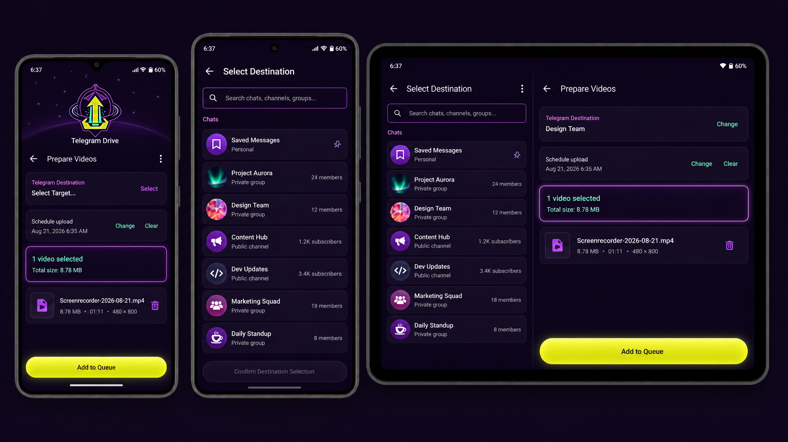

# Telegram Drive Uploader

**Android application for managing and uploading files and videos directly to Telegram destinations.**

Telegram Drive Uploader provides a high-reliability, offline-first interface for Telegram file delivery. Built with modern Android technologies (Jetpack Compose, Room, WorkManager, and Material 3), it leverages the official Telegram Database Library (TDLib) for authoritative transfer logic.

[](https://github.com/aistudio-build/telegram-drive-uploader/actions/workflows/android_ci.yml)
[](https://github.com/aistudio-build/telegram-drive-uploader/releases)

---

## Mission Control visual identity

Telegram Drive Uploader uses a **Mission Control** visual language: a dark control-room surface, luminous orbital accents, and a high-visibility upload action. The identity reinforces upload state and destination context while preserving Material 3 semantic roles and adaptive Compose layouts.

The current mark is the **Mission Control orbital upload logo**: a Lime upward arrow and tray enclosed by a Violet orbital form with Mint highlights. The canonical asset is [`app/src/main/res/drawable-nodpi/mission_control_logo.png`](app/src/main/res/drawable-nodpi/mission_control_logo.png). It is used by the launcher foreground, first-run onboarding hero, opening animation, and repository preview at [`design/app_icon_concept.png`](design/app_icon_concept.png).

### Design Previews
The following images show the current Material 3 Expressive direction, the Mission Control visual system, and the destination-selection and video-preparation flow.




---

## User Guide

### 1. Onboarding & First Run
On first launch, follow the Mission Control onboarding flow. Grant only the media permissions requested by your Android version. The opening animation is designed for the first-run experience and respects reduced-motion settings.

### 2. Authentication
Log in securely using your Telegram phone number or a QR code. The app uses real TDLib authentication; your credentials and session data are stored only on your device.

### 3. Uploading Files
- **Select Destination**: Search for a chat, group, or channel.
- **Queue Management**: Add multiple files; the app manages the queue in the background.
- **Reliability**: Uploads resume automatically after network loss or device restart thanks to WorkManager integration.
- **Smart Assistance**: Uses local heuristics to optimize video preparation and delivery.

---

## Developer Guide

### Prerequisites
- **JDK 17+** (JDK 21 recommended for current build matrices)
- **Android SDK** (API 34/35)
- **NDK** (Matching the version specified in `app/build.gradle.kts`)
- **Telegram API Credentials**: A valid [API ID and API hash][2] from [my.telegram.org](https://my.telegram.org).

### Getting Started
1. **Credentials**: Never commit real credentials. Provide them through the project’s Gradle configuration or secure environment variables.
2. **Local Setup**:
   ```bash
   ./scripts/verify-project.sh QUICK
   ```
3. **Device Validation**: A JVM build cannot prove native behavior. Validate native TDLib loading and authentication on a physical device or compatible emulator.

### Project Structure
```text
app/src/main/java/com/telegramdrive/uploader/
  core/                 Navigation, diagnostics, datastore, UI theme, and shared utilities
  data/                 TDLib client, repositories, upload data, and platform integrations
  domain/               Models, repository contracts, and upload state definitions
  feature/              Compose screens and ViewModels (Home, Uploads, History, Auth)

app/src/main/java/org/drinkless/tdlib/
  TdApi.java            Official generated TDLib API binding

app/src/main/jniLibs/{arm64-v8a,armeabi-v7a,x86_64}/
  libtdjni.so           Official TDLib native libraries

docs/                   Technical documentation and maintenance records
scripts/                Artifact validation and project helper scripts
```

### TDLib & Native Artifacts
The project includes official [TDLib][1] v1.8.66 native libraries. 

> **ABI Compatibility**: The project is currently configured to package only the `armeabi-v7a` binary to ensure universal compatibility across ARM devices (including ARM64) while only requiring a single checked-in native library.

Run the artifact gate from the project root:
```bash
./scripts/check-tdlib-artifacts.sh
```
For native dependency details, see [`docs/TDLIB_NATIVE_DEPENDENCIES.md`](docs/TDLIB_NATIVE_DEPENDENCIES.md).

### Build & Verification
```bash
./scripts/verify-project.sh FULL    # Standard verification
./scripts/verify-project.sh RELEASE # Release-ready validation
```
The project includes strict R8 keep rules for `org.drinkless.tdlib.**` required for JNI stability in minified builds.

### Release & CI
The `Android Signed Multi-ABI Release` workflow triggers on `v*` tags. It builds signed Release APKs for all supported ABIs, verifies checksums, and creates a GitHub Release.
See [`docs/maintenance/GITHUB_SIGNED_RELEASE_AUTOMATION.md`](docs/maintenance/GITHUB_SIGNED_RELEASE_AUTOMATION.md) for details.

---

## Security & Privacy
- **Privacy First**: Smart File Assistant is local; no remote AI keys are required.
- **Local Storage**: Telegram session data and the TDLib database are stored in private application storage. **Never share these files.**
- **Diagnostic Safety**: Diagnostics are privacy-conscious. Inspect logs before sharing; the system redacts sensitive identifiers by default.

---

## Troubleshooting

| Symptom | Recommended Action |
| :--- | :--- |
| **App closes on connect** | Check ABI-matching APK. Verify R8 keep rules. Check Logcat for native crashes. |
| **TDLib unavailable** | Confirm device ABI and verify `libtdjni.so` existence using `scripts/check-tdlib-artifacts.sh`. |
| **Credentials rejected** | Verify API ID (numeric) and API hash (complete). Don't confuse with login code. |
| **No chats found** | Complete auth, wait for chat updates, and confirm account permissions. |
| **Arabic layout issues** | Set system language to Arabic and restart. Verify RTL support. |
| **Release signing fails** | Check local keystore configuration. Never commit signing keys. |

---

## Documentation & References
- **Audit Records**: [`docs/PROJECT_AUDIT_2026-08-21.md`](docs/PROJECT_AUDIT_2026-08-21.md)
- **Maintenance Guide**: [`docs/maintenance/README.md`](docs/maintenance/README.md)
- **Resource Reviews**: [`docs/resources/`](docs/resources/)

[1]: https://github.com/tdlib/td "Official TDLib repository"
[2]: https://core.telegram.org/api/obtaining_api_id "Telegram API ID and Telegram API hash documentation"
[3]: https://developer.android.com/guide/topics/manifest/uses-sdk-element "Android SDK version documentation"
[4]: https://developer.android.com/studio/build/shrink-code "Android R8 and app optimization documentation"
[5]: https://m3.material.io/foundations/accessible-design/overview "Material Design 3 accessible design guidance"
[6]: https://m3.material.io/ "Material Design 3 documentation"

*Maintained for the Telegram Drive Uploader project.*
