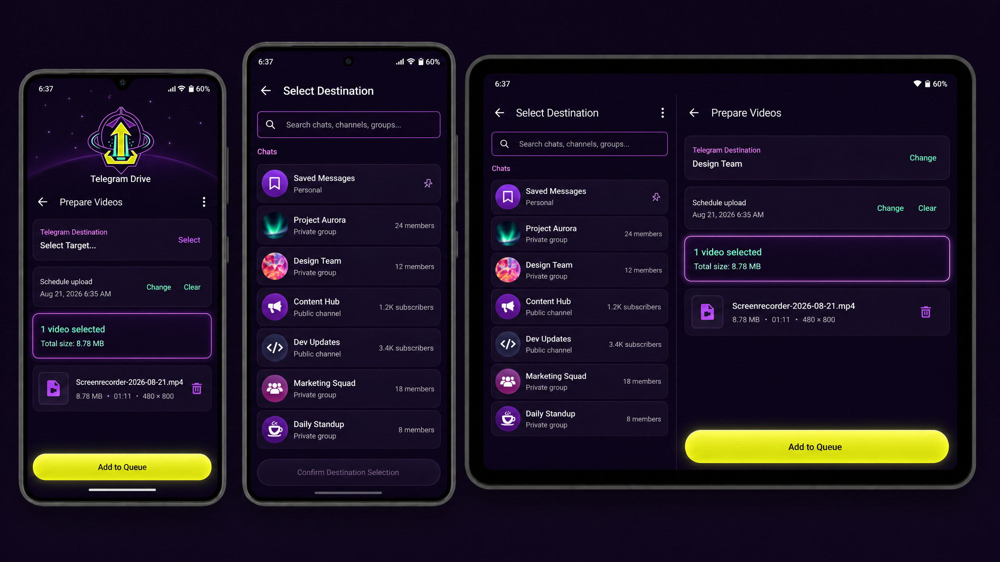
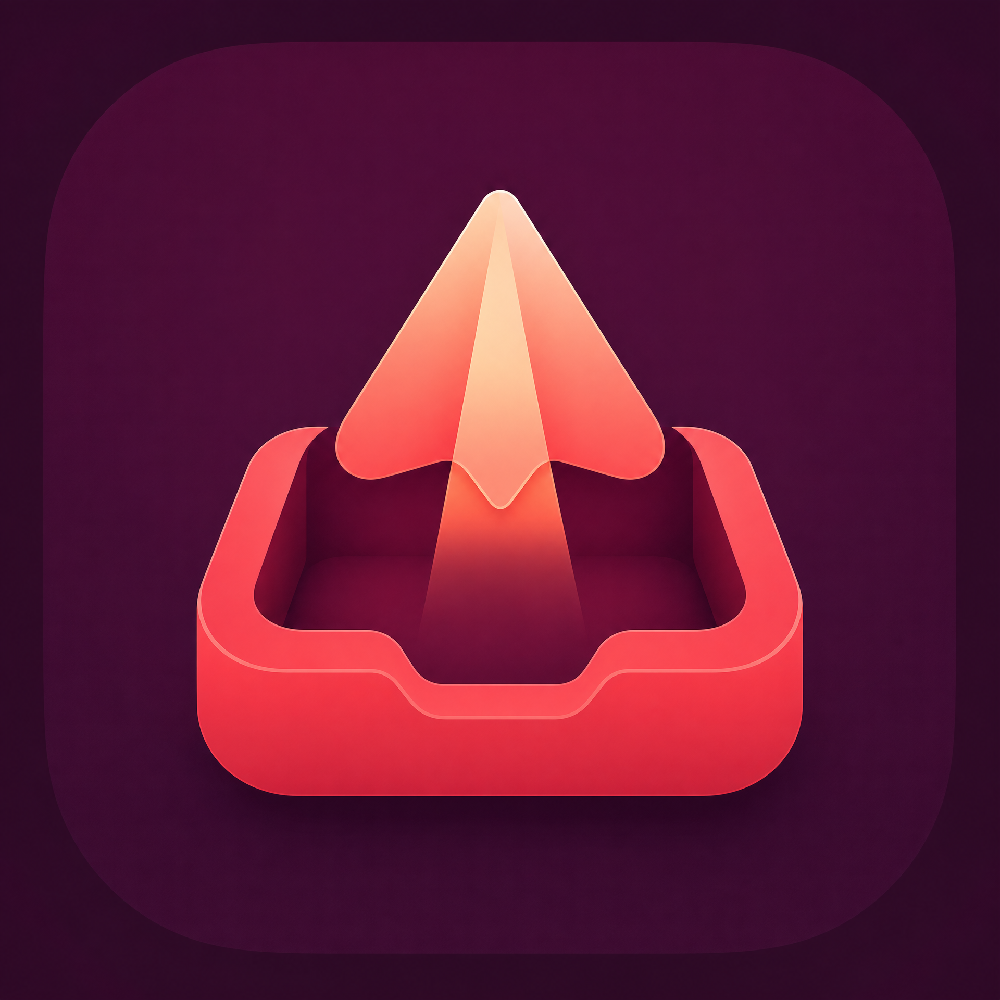

# Telegram Drive Uploader

**Android application for managing and uploading files and videos directly to Telegram destinations.**

Telegram Drive Uploader provides a high-reliability, offline-first interface for Telegram file delivery. Built with modern Android technologies (Jetpack Compose, Room, WorkManager, and Material 3), it leverages the official Telegram Database Library (TDLib) for authoritative transfer logic.

[](https://github.com/mohtiher3-afk/Telegram-Drive-Uploader/actions/workflows/android-ci.yml)
[](https://github.com/mohtiher3-afk/Telegram-Drive-Uploader/releases)
[](LICENSE)

---

## Mission Control visual identity

Telegram Drive Uploader uses a **Mission Control** visual language: a control-room surface, luminous orbital accents, and a high-visibility upload action. The identity reinforces upload state and destination context while preserving Material 3 semantic roles and adaptive Compose layouts.

The Mission Control surface ships as a full light and dark theme set rather than a single dark-only skin. **Settings → Appearance** selects `System`, `Light`, or `Dark`, and **Glow Color** picks one of six accent presets (Seafoam, Orchid, Cobalt, Lime, Cyan, Violet) or a custom hex value. `System` follows the device setting, which is the default. See [`docs/design/DESIGN_SYSTEM.md`](docs/design/DESIGN_SYSTEM.md) for the theme architecture.

The current mark is the **Mission Control orbital upload logo**: a Lime upward arrow and tray enclosed by a Violet orbital form with Mint highlights. The canonical asset is [`feature/src/main/res/drawable-nodpi/mission_control_logo.png`](feature/src/main/res/drawable-nodpi/mission_control_logo.png). It is used by the launcher foreground, first-run onboarding hero, opening animation, and repository preview at [`design/app_icon_concept.png`](design/app_icon_concept.png).

### Design Previews
The following images show the current Material 3 Expressive direction, the Mission Control visual system, and the destination-selection and video-preparation flow.




---

## User Guide

### 1. Onboarding & First Run
On first launch, follow the Mission Control onboarding flow. Grant only the media permissions requested by your Android version. The opening animation is designed for the first-run experience and respects reduced-motion settings.

### 2. Authentication
Log in securely using your Telegram phone number or a QR code. The app uses real TDLib authentication; your credentials and session data are stored only on your device.

### 3. Appearance
Open **Settings → Appearance** to choose how the app looks:

- **Theme**: `System` (follows the device, the default), `Light`, or `Dark`.
- **Glow Color**: the accent colour used for primary actions and progress. Pick one of the six presets — Seafoam, Orchid, Cobalt, Lime, Cyan, Violet — or choose `Custom` and enter your own hex value.
- **Dynamic Color**: choose `Full` (system wallpaper colors), `Brand Accented` (keeps your glow color), or `Static Brand` (app colors only).

All choices are stored on the device and applied immediately.

### 4. Uploading Files
- **Select Destination**: Search for a chat, group, or channel.
- **Queue Management**: Add multiple files; the app manages the queue in the background.
- **Reliability**: Uploads resume automatically after network loss or device restart thanks to WorkManager integration.
- **Smart Assistance**: Uses on-device Gemini Nano AI to analyze image content and suggest meaningful filenames and keywords.
- **Home Screen Widget**: View upload progress and queue status directly from your home screen.
- **App Shortcuts**: Long-press the app icon for quick access to New Upload or Queue.

---

## Developer Guide

### Prerequisites
- **JDK 17+** (JDK 21 recommended for current build matrices)
- **Android SDK** (API 37)
- **NDK** (Matching the version specified in `app/build.gradle.kts`)
- **Telegram API Credentials**: A valid [API ID and API hash][2] from [my.telegram.org](https://my.telegram.org).

### Getting Started
1. **Credentials**: Never commit real credentials. Provide them through the project’s Gradle configuration or secure environment variables.
2. **Local Setup**:
   ```bash
   ./scripts/verify-project.sh QUICK
   ```
   On Windows use the PowerShell port of the same checks (it does not need Git Bash):
   ```powershell
   .\scripts\verify-project.ps1 -Mode QUICK
   ```
   Both run the same four gates: compile every module, unit tests, lint with
   `warningsAsErrors`, and a debug APK assembly.

   On Windows the `app` module writes its build output to
   `%TEMP%\tdg-build\app\build` (a OneDrive reparse-point workaround, see
   `app/build.gradle.kts`), so the debug APK lands at
   `%TEMP%\tdg-build\app\build\outputs\apk\debug\app-debug.apk` rather than
   `app/build/outputs`.
3. **Device Validation**: A JVM build cannot prove native behavior. Validate native TDLib loading and authentication on a physical device or compatible emulator.

### Project Structure
```text
app/src/main/java/com/telegramdrive/uploader/
  core/                 Navigation, DI wiring, and remaining app shell
  (feature UI now lives in the :feature module below)

feature/                :feature Android module - Compose screens, ViewModels, theme + shared UI components
core/                   :core Kotlin module - diagnostics, Gemini Nano AI assistant, and shared utilities
data/                   :data Android module - TDLib client, repositories, Room, upload engine and WorkManager worker
domain/                 :domain Kotlin module - models, repository contracts, and pure upload state logic
widget/                 :app widget - home screen upload status widget with WorkManager updates

data/src/main/java/org/drinkless/tdlib/
  TdApi.java            Official generated TDLib API binding

data/src/main/jniLibs/{arm64-v8a,armeabi-v7a,x86_64}/
  libtdjni.so           Official TDLib native libraries

docs/                   Technical documentation and maintenance records
scripts/                Artifact validation and project helper scripts
```

### TDLib & Native Artifacts
The project includes official [TDLib][1] v1.8.66 native libraries. 

> **ABI Compatibility**: Official TDLib native libraries are checked in for `arm64-v8a`, `armeabi-v7a`, and `x86_64`. The signed release workflow builds a per-ABI APK for each, so devices install the binary matching their ABI.

Run the artifact gate from the project root:
```bash
./scripts/check-tdlib-artifacts.sh
```
For native dependency details, see [`docs/dependencies/TDLIB_NATIVE_DEPENDENCIES.md`](docs/dependencies/TDLIB_NATIVE_DEPENDENCIES.md).

### Build & Verification
```bash
./scripts/verify-project.sh FULL    # Standard verification
./scripts/verify-project.sh RELEASE # Release-ready validation
```
The project includes strict R8 keep rules for `org.drinkless.tdlib.**` required for JNI stability in minified builds.

### Performance & Baseline Profile
A committed baseline profile lives at [`app/src/main/baseline-prof.txt`](app/src/main/baseline-prof.txt) and is consumed by R8 on every release build. It matters here because the app loads `libtdjni.so` through JNI and initialises a TDLib client before Compose draws, so cold start is the expensive path.

Regenerate it after changing startup code — this **requires a connected device or emulator**:
```bash
./gradlew :benchmark:collectNonMinifiedReleaseBaselineProfile
```

Measure cold and warm startup:
```bash
./scripts/measure-startup.sh
```

> **A physical device is required for startup measurements.** `androidx MacrobenchmarkRule` deliberately skips emulators — emulator timings measure the host rather than the app, so the rule raises `AssumptionViolatedException` instead of publishing a meaningless number. Profile *generation* does run on an emulator; only the timings need real hardware.

### Release & CI
The `Android Multi-ABI CI` workflow runs on Pull Requests and pushes to `main`. It executes repository security and artifact gates, JVM unit tests, release lint, and a Debug APK build for `arm64-v8a`, `armeabi-v7a`, and `x86_64`, then stores each APK as a temporary artifact.

The `Android Signed Multi-ABI Release` workflow triggers on `v*` tags. It builds signed Release APKs for all supported ABIs, verifies signatures and SHA-256 checksums, and creates a GitHub Release. The complete setup, required secrets, tag flow, and troubleshooting steps are documented in [`docs/ci/CI_GUIDE.md`](docs/ci/CI_GUIDE.md) and [`docs/maintenance/GITHUB_SIGNED_RELEASE_AUTOMATION.md`](docs/maintenance/GITHUB_SIGNED_RELEASE_AUTOMATION.md).

---

## Security & Privacy
- **Privacy First**: Smart File Assistant uses on-device Gemini Nano; no remote AI keys are required and image content never leaves the device.
- **Local Storage**: Telegram session data and the TDLib database are stored in private application storage. **Never share these files.**
- **No Session Backup**: `allowBackup` is disabled, so TDLib session files are excluded from cloud backup and device-to-device transfer. Re-authenticate after a fresh install.
- **Network Security**: All network traffic is encrypted (TLS). Certificate pinning prevents man-in-the-middle attacks. Cleartext traffic is blocked.
- **Screen Protection**: `FLAG_SECURE` prevents screenshots and screen recording of sensitive upload data.
- **Diagnostic Safety**: Diagnostics are privacy-conscious. Inspect logs before sharing; the system redacts sensitive identifiers by default.

---

## Troubleshooting

| Symptom | Recommended Action |
| :--- | :--- |
| **App closes on connect** | Check ABI-matching APK. Verify R8 keep rules. Check Logcat for native crashes. |
| **TDLib unavailable** | Confirm device ABI and verify `libtdjni.so` existence using `scripts/check-tdlib-artifacts.sh`. |
| **Credentials rejected** | Verify API ID (numeric) and API hash (complete). Don't confuse with login code. |
| **No chats found** | Complete auth, wait for chat updates, and confirm account permissions. |
| **Arabic layout issues** | Set system language to Arabic and restart. Verify RTL support. |
| **Release signing fails** | Check local keystore configuration. Never commit signing keys. |

---

## Documentation & References
- **Contributing**: [`CONTRIBUTING.md`](CONTRIBUTING.md)
- **Security Policy**: [`SECURITY.md`](SECURITY.md)
- **Changelog**: [`CHANGELOG.md`](CHANGELOG.md)
- **License**: [`LICENSE`](LICENSE) (MIT)
- **Audit Records**: [`docs/maintenance/REPOSITORY_CERTIFICATION.md`](docs/maintenance/REPOSITORY_CERTIFICATION.md), [`docs/operations/MAINTENANCE_CERTIFICATION.md`](docs/operations/MAINTENANCE_CERTIFICATION.md)
- **Maintenance Guide**: [`docs/maintenance/README.md`](docs/maintenance/README.md)
- **Resource Reviews**: [`docs/resources/`](docs/resources/)

[1]: https://github.com/tdlib/td "Official TDLib repository"
[2]: https://core.telegram.org/api/obtaining_api_id "Telegram API ID and Telegram API hash documentation"
[3]: https://developer.android.com/guide/topics/manifest/uses-sdk-element "Android SDK version documentation"
[4]: https://developer.android.com/studio/build/shrink-code "Android R8 and app optimization documentation"
[5]: https://m3.material.io/foundations/accessible-design/overview "Material Design 3 accessible design guidance"
[6]: https://m3.material.io/ "Material Design 3 documentation"

*Maintained for the Telegram Drive Uploader project.*
